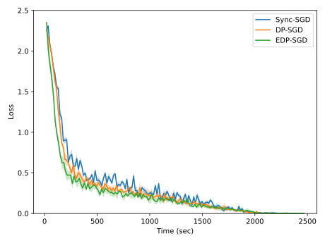

  [![Contributors][contributors-shield]][contributors-url] [![Forks][forks-shield]][forks-url] [![Stargazers][stars-shield]][stars-url] [![Issues][issues-shield]][issues-url] [![MIT License][license-shield]][license-url] [![LinkedIn][linkedin-shield]][linkedin-url]

<!-- PROJECT LOGO -->
<br />

<p align="center">
  <h2 align="center">Distributed Optimization using Heterogeneous Compute Systems</h2>
  <p align="center">
    <a href=https://github.com/vineeths96/Heterogeneous-Systems><strong>Explore the repository»</strong></a>
    <br />
    <a href=https://arxiv.org/abs/2110.08941>View Paper</a>
  </p>


</p>

> tags : distributed optimization, large-scale machine learning, heterogenous systems, edge learning, federated learning, deep learning, pytorch 


### Code for the paper [Distributed Optimization using Heterogeneous Compute Systems](https://arxiv.org/abs/2110.08941).


<!-- ABOUT THE PROJECT -->

## About The Project

Hardware compute power has been growing at an unprecedented rate in recent years. The utilization of such advancements plays a key role in producing better results in less time -- both in academia and industry. However, merging the existing hardware with the latest hardware within the same ecosystem poses a challenging task. One of the key challenges, in this case, is varying compute power. In this paper, we consider the training of deep neural networks on a distributed system of workers with varying compute power. A naive implementation of synchronous distributed training will result in the faster workers waiting for the slowest worker to complete processing. To mitigate this issue, we propose to dynamically adjust the data assigned for each worker at every epoch during the training. We assign each worker a partition of total data proportional to its computing power. By adjusting the data partition to the workers, we directly control the workload on the workers. We assign the partitions, and hence the workloads, such that the time taken to process the data partition is almost uniform across the workers. We empirically evaluate the performance of the dynamic partitioning by training deep neural networks on the CIFAR10 dataset. We examine the performance of training ResNet50 (computation-heavy) model and VGG16 (computation-light) model with and without the dynamic partitioning algorithms. Our experiments show that dynamically adjusting the data partition helps to improve the utilization of the system and significantly reduces the time taken for training.

### Built With
This project was built with 

* python v3.7.6
* PyTorch v1.7.1
* The environment used for developing this project is available at [environment.yml](environment.yml).


<!-- GETTING STARTED -->

## Getting Started

Clone the repository into a local machine using,

```shell
git clone https://github.com/vineeths96/Heterogeneous-Systems
cd Heterogeneous-Systems/
```

### Prerequisites

Create a new conda environment and install all the libraries by running the following command

```shell
conda env create -f environment.yml
```

The dataset used in this project (CIFAR 10) will be automatically downloaded and setup in `data` directory during execution.

### Instructions to run

The training of the models can be performed on a distributed cluster with multiple machines and multiple worker GPUs. We make use of `torch.distributed.launch` to launch the distributed training. More information is available [here](https://pytorch.org/tutorials/beginner/dist_overview.html).

To launch distributed training on a single machine with multiple workers (GPUs), 

```shell
python -m torch.distributed.launch --nproc_per_node=<num_gpus> trainer.py --local_world_size=<num_gpus> 
```

 To launch distributed training on multiple machine with multiple workers (GPUs), 

```sh
export NCCL_SOCKET_IFNAME=ens3

python -m torch.distributed.launch --nproc_per_node=<num_gpus> --nnodes=<num_machines> --node_rank=<node_rank> --master_addr=<master_address> --master_port=<master_port> trainer.py --local_world_size=<num_gpus>
```


## Model overview

We conducted experiments on [ResNet50](https://arxiv.org/abs/1512.03385) architecture and [VGG16](https://arxiv.org/abs/1409.1556) architecture. Refer the original papers for more information about the models. We use publicly available implementations from [GitHub](https://github.com/kuangliu/pytorch-cifar) for reproducing the models. 


<!-- RESULTS -->

## Results

We highly recommend to read through the [paper](https://arxiv.org/abs/2110.08941) before proceeding to this section. The paper explains the dynamic partitioning schemes we propose and contains many more analysis & results than what is presented here. 

We begin with an explanation of the notations used for the plot legends in this section. *Sync-SGD* corresponds to the default gradient aggregation provided by PyTorch. *DP-SGD* and *EDP-SGD* corresponds to *Dynamic Partitioning* and *Enhanced Dynamic Partitioning* respectively. We artificially simulate heterogeneity by adding time delays to a subset of workers. We evaluate the algorithms for a low level of heterogeneity and a high level of heterogeneity.


|                           ResNet50                           |                            VGG16                             |
| :----------------------------------------------------------: | :----------------------------------------------------------: |
|  Loss Curve   |    Loss Curve    |
| Without Dynamic Partitioning | Without Dynamic Partitioning |
| With Dynamic Partitioning | With Dynamic Partitioning |


<!-- LICENSE -->

## License

Distributed under the MIT License. See `LICENSE` for more information.


<!-- CONTACT -->

## Contact

Vineeth S - vs96codes@gmail.com

Project Link: [https://github.com/vineeths96/Heterogeneous-Systems](https://github.com/vineeths96/Heterogeneous-Systems)


<!-- MARKDOWN LINKS & IMAGES -->
<!-- https://www.markdownguide.org/basic-syntax/#reference-style-links -->

[contributors-shield]: https://img.shields.io/github/contributors/vineeths96/Heterogeneous-Systems.svg?style=flat-square
[contributors-url]: https://github.com/vineeths96/Heterogeneous-Systems/graphs/contributors
[forks-shield]: https://img.shields.io/github/forks/vineeths96/Heterogeneous-Systems.svg?style=flat-square
[forks-url]: https://github.com/vineeths96/Heterogeneous-Systems/network/members
[stars-shield]: https://img.shields.io/github/stars/vineeths96/Heterogeneous-Systems.svg?style=flat-square
[stars-url]: https://github.com/vineeths96/Heterogeneous-Systems/stargazers
[issues-shield]: https://img.shields.io/github/issues/vineeths96/Heterogeneous-Systems.svg?style=flat-square
[issues-url]: https://github.com/vineeths96/Heterogeneous-Systems/issues
[license-shield]: https://img.shields.io/badge/License-MIT-yellow.svg
[license-url]: https://github.com/vineeths96/Heterogeneous-Systems/blob/master/LICENSE
[linkedin-shield]: https://img.shields.io/badge/-LinkedIn-black.svg?style=flat-square&logo=linkedin&colorB=555
[linkedin-url]: https://linkedin.com/in/vineeths

